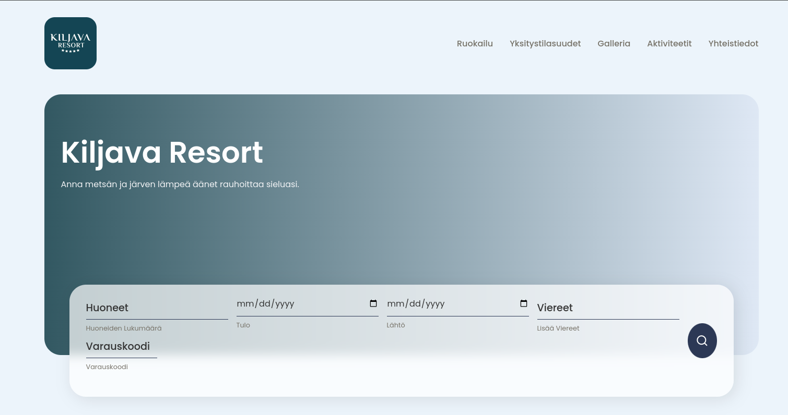

# Dokumentointi

**Johdanto**


*Tämä dokumentaatio kertoo ja näyttää yleiskatsauksen projektin taustoista ja toiminnalisuudesta. Tarkoituksena on auttaa käyttäjää ja tiimimme ymmärtämään projektin perusperiaatteet ja käyttö ohjeet,*


**Sisältö**

   1. Projekti
   2. Asiakas
   3. Suunnittelu
   4. Projektin-Alku
   5. Projektin keskivaihe
   6. Ekat virheet ja niiden ratkaisu
   7. Uusi strategia

      # Projekti


**Projektin** *kohde oli tehdä alusta asti kokonaan toimiva netti sivusto hotellille, hotellin nimi on "Hotel Kiljava".*


# Asiakas


**Asiakalta** *olemme ottaneet yhteyttä, asiakaamme ja saaneet pikkusen ymmärystä mitä uutta ne haluaisivat uuteen netti sivustoon

1. saunan varausta
2. kabineetejen varausta
3. antaa netti sivustolle uuden näön

 ja meille annetii aikaa tehä tämä projekti lokakuuhun asti*


 ## Vaatimukset

**Projektin vaatimukset asetettiin seuraavien periaatteiden mukaan:**

1. **Toiminnalliset vaatimukset:**
   - Saunojen ja kabinetin varausmahdollisuus suoraan sivustolta.
   - Helppokäyttöinen navigointi, jossa käyttäjä löytää nopeasti tarvittavat tiedot.
   - Kielenä suomi ja englanti.

2. **Ei-toiminnalliset vaatimukset:**
   - Hyvä hakukoneoptimointi (SEO), jotta hotelli löytyy helposti hakukoneista.
   - Luotettava ja turvallinen varausjärjestelmä.

---


 # Projektin Suunittelu

**Käyttäjäkokemus** * (UX), Määriteltiin käyttäjäpolut ja varmistettiin, että sivuston navigointi on intuitiivista ja sujuvaa.*




**Tavoitteet ja Prioriteetit**

*Projektin suunnitteluvaiheessa asetettiin prioriteeteja

**1. Ammatillinen Ulkonäkö:** Tavoitteena oli luoda visuaalisesti mukava ja ammattimainen verkkosivusto joka edustaa hotellin brändiä.


**2. Responsiivisuus:** Sivuston suunnittelussa otettiin huomioon sen toimivuus eri laitteilla,ninkuin älypuhelimet ja tabletit. Tavoitteena oli, että sivusto näyttää hyvältä ja toimii sujuvasti kaikilla näyttökokoilla.

**3. testit ja käyttökelvollisuus:** kiinnitettiin erityistä huomiota siihen, että sivuston ulkoasu on miellyttävä ja ystävällinen (eli helppo käyttää, ja tajuu heti missä on mitä). Tiimi testasi ja arvioi jatkuvasti koodin päivityksiä ja huomioi mahdolliset parannettavat kohdat.
Sisällön Suunnittelu

**4. Sisällön Täyttö:** Asiakas halusi käyttää samoja kuvia ja tekstejä kuin vanhassa sivustossa, joten sisällön täyttö oli suhteellisen helppo. Tämä helpotti ja säästi aikaa, kuvan ettimiseen ja tekstin keksimiseen.*


# Projektin alku

**Projektin alkuvaiheessa frontend oli vielä varsin raakaa, ja työtehtävät eivät olleet selkeästi jaettu. Tämä johti siihen, että projekti ei edistynyt toivotulla vauhdilla.**


# Projektin keskivaihe

*Ruvettiin vaihtamaan projektin ulko näköä kordinaalisest.
Sinisen meren backgroundin vaihettii valkoseks, otettiin liian isot ja silmän häiritsevät värit pois, meidän idiea oli tehä minimaalinen ja enemmän ammatilaisen näköinen netti sivusto*

## HTML

```html
<section class="section__container popular__container">
    <h2 class="section__header" style="color: #144544; font-style: italic;">KILJAVA RESORTIN HUONEET</h2><br><br><br>
    <div class="popular__grid">
      <div class="popular__card">
        
        <div class="popular__content">

```


## CSS 

```css
.button-54:active {
    box-shadow: 0px 0px 0px 0px;
    top: 5px;
    left: 5px;
  }
  
  @media (min-width: 768px) {
    .button-54 {
      padding: 0.25em 0.75em;
    }
  }
```


## JS 

``` js
/*---Etusivu---*/
let next = document.querySelector('.next')
let prev = document.querySelector('.prev')

next.addEventListener('click', function()
{
    let items = document.querySelectorAll('.item')
    document.querySelector('.slide').appendChild(items[0])
})
prev.addEventListener('click', function()
{
    let items = document.querySelectorAll('.item')
    document.querySelector('.slide').prepend(items[items.length - 1])
})
/*---Etusivu---*/
```


      

# Ekat virheet ja niiden ratkaisu


*Frontend oli varsin kehittymätön, eikä työtehtäviä ollut jaettu selkeästi. Tämä hidasti projektin etenemistä*

**Ratkaisu:**  *Otettiin käyttöön Git ja GitHub, jotta koodin jakaminen ja versiohallinta helpottui. Tämä mahdollisti nopeamman ja tehokkaamman yhteistyön tiimin jäsenten välillä.*


# Riskit


**Asiakas ei vastaa**  

*Me Jatkamme front-end loppuun asti, heti kun asikas on vastanut meille, jatketaan back-endi.*

**Asikas kanssa palaveri**

*Palaverissa asiakkaan kanssa kävi ilmi, että heillä ei ole tarkkaa tietoa backend-järjestelmästä. Esitin myös kysymyksen admin-paneelin käytöstä, mutta asiakas ei osannut antaa tietoa siitäkään.*

**Asiakkaan epäselvät vaatimukset**

*Vaatimusten epäselvyys voi johtaa siihen, että kehitetty ratkaisu ei vastaa asiakkaan tarpeita. Tämä lisää korjauskierroksia ja resurssien käyttöä.*

**Kommunikaatiokatkokset asiakkaan ja tiimin välillä**

*Jos tiedonkulku ei ole sujuvaa, projektin prioriteetit ja tekniset ratkaisut voivat jäädä epäselviksi.*

**Mahdolliset muutokset asiakkaan tarpeissa**

*Mikäli asiakas muuttaa mielipidettään tai tarpeitaan projektin aikana, se voi aiheuttaa lisätöitä ja viivästyksiä.*

# Käyttöohjeet: Mitä voit tehdä verkkosivustolla?

1. **Huoneiden selaaminen ja varaaminen:**
   - Käyttäjä voi tarkastella hotellin huonevaihtoehtoja, nähdä kuvia ja lukea lisätietoja huonetyypeistä.

2. **Saunojen ja kabinetin varaaminen:**
   - Käyttäjä voi valita haluamansa palvelun.

3. **Tapahtumat ja tarjoukset:**
   - Erillinen osio hotellin tarjoamille tapahtumille ja kausikohtaisille tarjouksille.

4. **Yhteydenotto:**
   - Sivustolla on yhteydenottolomake, jonka avulla käyttäjät voivat ottaa yhteyttä hotelliin kysymyksiä tai erityistoiveita varten.

5. **Tietoa hotellista:**
   - Hotellin sijainti, yhteystiedot ja lisäpalvelut (kuten ravintola ja kuntosali) ovat helposti löydettävissä.

6. **Monikielisyys:**
   - Käyttäjä voi valita kielen (suomi/englanti) sivuston yläkulmasta.

7. **Palautteen antaminen:**
   - Mahdollisuus jättää palautetta suoraan verkkosivustolle.


# Loppu

**Projektin päätös**  
*Projektin aikana tiimi teki hienoa työtä ja saimme kaikki Front end -osat valmiiksi, vaikka meni vähän yli aikaakin. Jokainen osallistuja toi oman osaamisensa projektiimme, ja yhdessä pystyimme ratkaisemaan haasteita. Olemme jakaneet työtä ja käytimme työkaluja kuten. Git,Github. Projektin aikana opimme paljon, ja vaikka välillä tuli vastaan ongelmia, kuten asiakaan epä selvät vaatimukset, tiimin yhteistyöllä saimme ne ratkaistua.*


